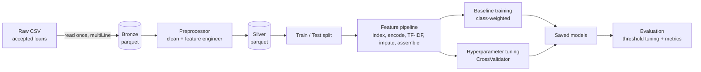
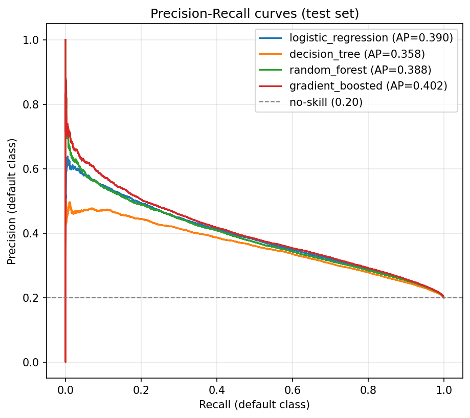
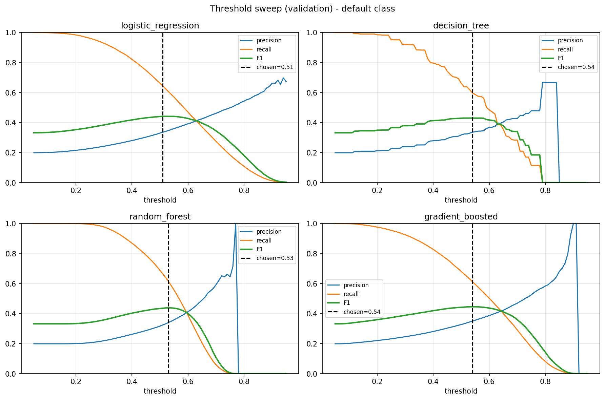
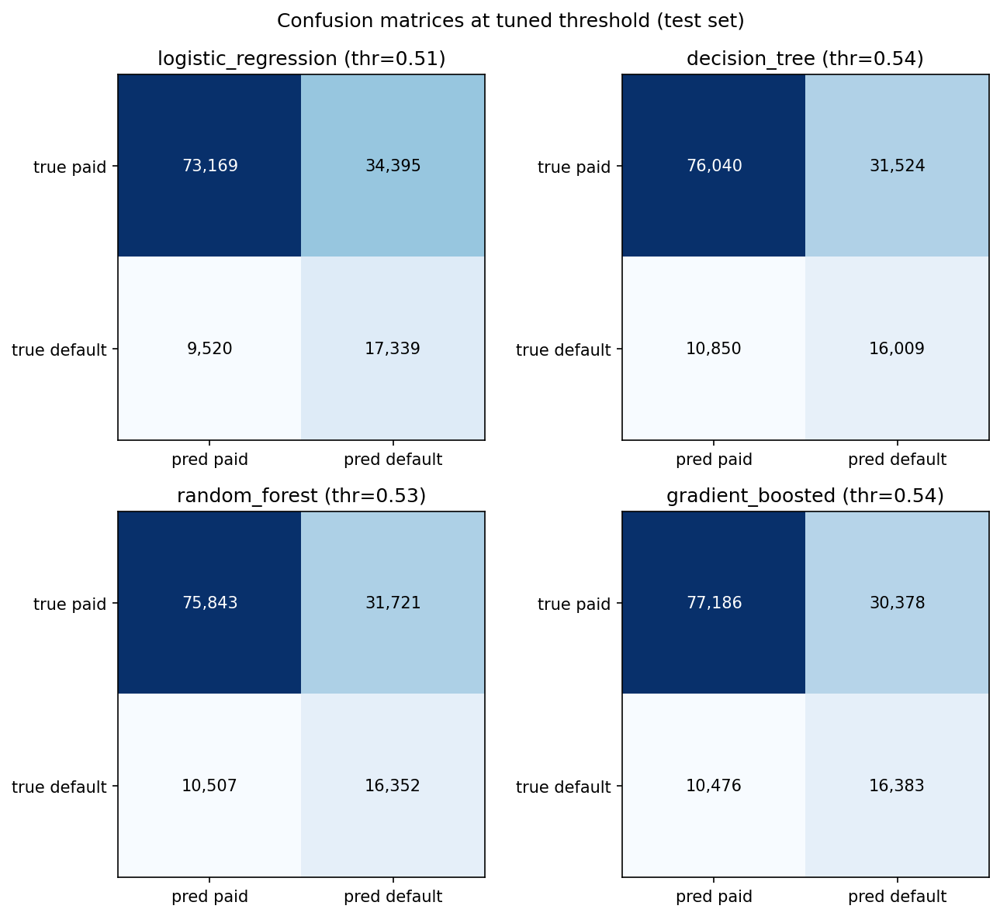
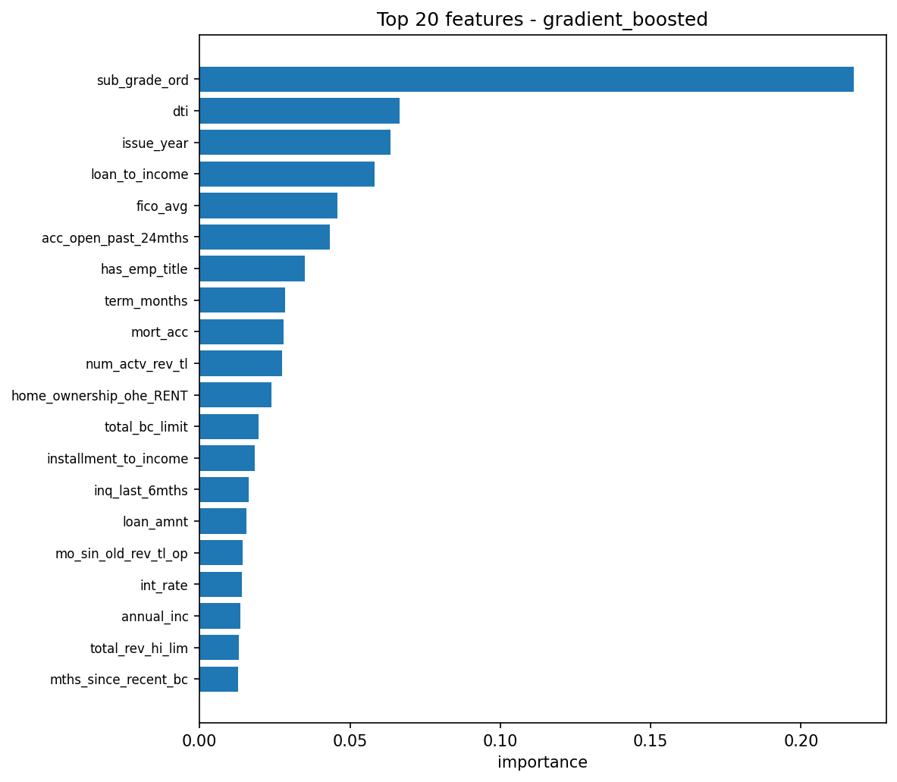

# Loan Default Prediction — PySpark ML Pipeline


An end-to-end, production-style machine learning pipeline that predicts whether a
LendingClub loan will **default**, built entirely on **PySpark** with a medallion
data architecture, class-imbalance handling, hyperparameter tuning, and
decision-threshold optimization.

> The focus of this project is **engineering correctness and honest evaluation**,
> not a leaderboard score. Several of the strongest predictors in this dataset are
> assigned by LendingClub's own risk model, so the interesting work is in building
> a clean, leakage-aware pipeline and evaluating it the right way under heavy class
> imbalance — see [Key engineering decisions](#key-engineering-decisions).

---

## Problem

Given the features known **at loan origination** (amount, term, employment, FICO
range, debt ratios, etc.), predict whether the loan will eventually be charged
off / default. The data is the public
[LendingClub accepted-loans dataset](https://www.kaggle.com/datasets/wordsforthewise/lending-club)
(~2M loans, 2007–2018). The target is highly imbalanced — roughly **80% of loans
are repaid**, which shapes every modeling and evaluation choice below.

## Pipeline at a glance



The **medallion layers are persisted to parquet and reused**: the slow one-time CSV
parse and the full preprocessing pass only run once. Every subsequent training,
tuning, or evaluation run reads the typed, columnar `silver` parquet instead of
re-reading the raw 1.6 GB file.

## Results

Evaluated on a held-out test slice. Threshold is tuned to maximize **F1 on the
default class** (the minority class) on a separate validation slice — see
[honest evaluation](#3-honest-evaluation-under-imbalance).

| Model | AUC | Default-class F1 @0.5 | Default-class F1 (tuned) | Default-class recall (tuned) |
|-------|----:|----------------------:|-------------------------:|-----------------------------:|
| Logistic Regression | `<fill>` | `<fill>` | `<fill>` | `<fill>` |
| Decision Tree       | `<fill>` | `<fill>` | `<fill>` | `<fill>` |
| Random Forest       | `<fill>` | `<fill>` | `<fill>` | `<fill>` |
| Gradient Boosted    | `<fill>` | `<fill>` | `<fill>` | `<fill>` |

> Fill these in from `loan_check/models/tuned_evaluation_results.csv`.

<!-- Add plots here once generated, e.g.:




-->

**Takeaways**

- AUC is similar across models and barely moves with tuning — expected, since a few
  near-deterministic features cap the ranking quality.
- The meaningful gains are in **default-class recall/F1**, driven by class weighting
  and threshold tuning rather than by the choice of algorithm.

## Key engineering decisions

### 1. Medallion architecture with parquet reuse
- **Bronze** — raw CSV converted to parquet, read exactly once. `multiLine` parsing
  is kept on because the raw `desc` field contains borrower free-text with embedded
  newlines, which makes the CSV non-splittable; persisting to parquet means that slow
  single-threaded read is paid only once.
- **Silver** — the cleaned, typed, feature-engineered table, persisted to parquet.
- A `_SUCCESS` marker check lets each layer be safely reused across runs, so the
  expensive read + preprocessing never repeats.

### 2. Leakage prevention
- **Post-origination columns dropped** — fields only knowable *after* a loan is
  issued (recoveries, total payments, settlement/hardship flags, etc.) are excluded;
  including them would leak the outcome.
- **Imputation deferred into the ML pipeline** so medians are learned on the training
  split only, never on test.
- **Class weights computed from the training split only.**

### 3. Honest evaluation under imbalance
- Accuracy is deliberately de-emphasized — predicting "everyone repays" already scores
  ~80%. Reporting centers on **AUC** and **default-class precision / recall / F1**.
- **Class weights** (balanced) stop the minority default class from being drowned out
  during fitting.
- **Decision-threshold tuning** sweeps cutoffs to maximize default-class F1, instead
  of blindly using 0.5.
- Threshold is selected on a **validation slice** and reported on a **disjoint test
  slice**, so the reported numbers aren't inflated by tuning on the same rows.

### 4. Efficient hyperparameter tuning
- The shared feature stages are fit **once**; `CrossValidator` then tunes only the
  estimator on the **cached feature matrix**, avoiding re-fitting the indexers,
  encoders, TF-IDF vectorizer, and imputer for every fold and every model.
- The best estimator is stitched back onto the fitted feature stages so the tuned
  model saves in the same end-to-end format as the baseline.

### 5. Feature engineering (PySpark ML)
Ordinal encoding of `sub_grade`, an averaged `fico_avg`, date-derived features
(`credit_hist_months`, `issue_year`), missing-value indicator flags, ratio features,
one-hot encoding of nominal columns, and a TF-IDF representation of the free-text
loan `title`.

## Project structure

```
loan_default_prediction/
├── config/
│   ├── config.py                 # PROJECT_ROOT + loads config.yaml (paths anchored to root)
│   └── config.yaml               # data paths, model dir, seed, test size
├── data/                         # gitignored — generated locally
│   ├── raw_data/                 # LendingClub accepted CSV
│   ├── bronze/                   # raw -> parquet  (read once)
│   └── silver/                   # preprocessed -> parquet
├── loan_check/
│   ├── feature_engineering/
│   │   ├── download_data.py       # downloads the dataset via kagglehub
│   │   ├── ingestion.py           # LendingClubPipeline: bronze/silver builders + Spark session
│   │   ├── preprocessing.py       # Preprocessor: cleaning + feature engineering
│   │   ├── feature_config.py      # loads feature_seperation.yaml
│   │   └── feature_seperation.yaml# column groups, target labels, ordinal maps
│   ├── classifiers/
│   │   ├── base_classifier.py     # BaseClassifier(ABC): train / predict / save / load
│   │   ├── logistic_regression.py
│   │   ├── decision_tree.py
│   │   ├── random_forest.py
│   │   └── gradient_booster.py
│   ├── train/training.py          # baseline training (class-weighted)
│   ├── tune/tuning.py             # CrossValidator hyperparameter tuning
│   ├── evaluate/evaluation.py     # threshold tuning + metrics (CLI)
│   └── utils/utils.py             # shared helpers (feature stages, weights, param grids)
├── pyproject.toml
└── README.md
```

## Tech stack

**PySpark 4.1** (Spark SQL + Spark ML) · **Python 3.10** · **uv** for environment
and dependency management · **kagglehub** for data download · **pandas / numpy** for
driver-side metric computation.

## Getting started

### 1. Setup
```bash
# install dependencies into a managed virtual environment
uv sync
```
Requires a Java 17+ runtime on the machine (PySpark 4 needs a JVM).

### 2. Download the data
```bash
python -m loan_check.feature_engineering.download_data
```
This pulls the LendingClub dataset via `kagglehub` into `data/raw_data/`
(requires Kaggle API credentials configured locally).

### 3. Train baseline models
```bash
python -m loan_check.train.training
```
Builds bronze + silver on first run, then trains all four class-weighted classifiers
and saves them to `loan_check/models/<name>_baseline`.

### 4. Tune hyperparameters
```bash
python -m loan_check.tune.tuning
```
Cross-validates each model and saves the best to `loan_check/models/<name>_tuned`,
with the winning hyperparameters logged to `grid_search_results.csv`.

### 5. Evaluate
```bash
# evaluate all tuned models
python -m loan_check.evaluate.evaluation --model tuned

# or a single classifier
python -m loan_check.evaluate.evaluation --model baseline --classifier random_forest
```
Reports AUC and default-class precision/recall/F1 at both the default 0.5 cutoff and
the tuned threshold, and writes `<model>_evaluation_results.csv`.

> **Note on hardware.** Spark runs in local mode and is configured for a machine with
> ~16 GB RAM (`spark.driver.memory=8g`, `local[8]`). On a smaller machine, lower these
> in `loan_check/feature_engineering/ingestion.py`.

## Limitations & next steps

- **Spark on a single machine is overhead, not speedup.** For a ~2M-row dataset that
  fits in memory, single-node tooling would train faster; Spark's value here is
  demonstrating a distributed, scalable pipeline pattern.
- **The score ceiling is set by the data.** `grade`, `sub_grade`, and `int_rate` are
  derived from LendingClub's own default model, so the classifier is partly
  re-predicting an existing prediction. Training without them would yield a more
  independent (and more interesting) risk model.
- **Planned:** experiment tracking with **MLflow**, a **batch scoring** entrypoint
  applying the tuned threshold, **pytest** coverage for the preprocessing and
  evaluation logic, and containerization.

---

*Built as a portfolio project to practice production-style ML engineering with PySpark.*